# Báo cáo Dự án Transfer Trail

## Mục lục
1. [Tổng quan](#1-tổng-quan)
2. [Giới thiệu](#2-giới-thiệu)
3. [Kiến trúc Hệ thống](#3-kiến-trúc-hệ-thống)
4. [Giao diện Người dùng](#4-giao-diện-người-dùng)
5. [Thành phần phía Client](#5-thành-phần-phía-client)
6. [Thành phần phía Server](#6-thành-phần-phía-server)
7. [Giao thức giao tiếp (Protocol Communication)](#7-giao-thức-giao-tiếp-protocol-communication)
8. [Xử lý File Lớn](#8-xử-lý-file-lớn)
9. [Bảo mật](#9-bảo-mật)
10. [Hướng dẫn chạy phần mềm](#10-hướng-dẫn-chạy-phần-mềm)
11. [Kết luận và Hướng phát triển](#11-kết-luận-và-hướng-phát-triển)
12. [Phụ lục](#12-phụ-lục)
13. [Tài liệu tham khảo](#13-tài-liệu-tham-khảo)

## 1. Tổng quan

Transfer Trail là một ứng dụng truyền file client-server được phát triển nhằm tối ưu hóa quá trình truyền file giữa các thiết bị qua mạng. Dự án này nhằm mục đích cung cấp một giải pháp đơn giản, hiệu quả và đáng tin cậy cho việc chia sẻ file mà không cần dựa vào các dịch vụ lưu trữ đám mây của bên thứ ba.

Báo cáo này trình bày chi tiết về kiến trúc, thiết kế và triển khai của Transfer Trail, bao gồm các khía cạnh kỹ thuật, giao diện người dùng, và các tính năng chính của ứng dụng.

## 2. Giới thiệu

### 2.1 Công nghệ và Thư viện

Transfer Trail được xây dựng dựa trên các công nghệ và thư viện sau:

1. **Electron**: Framework để xây dựng ứng dụng desktop đa nền tảng.
2. **Node.js**: Môi trường runtime JavaScript (v20.15.1 trở lên).
3. **Python**: Ngôn ngữ lập trình cho phía server (Python 3.12.3 trở lên).
4. **Socket Programming**: Kỹ thuật lập trình cho giao tiếp mạng.

#### 2.1.1 Thư viện chuẩn Python

- `socket`: Cho lập trình mạng
- `threading`: Để xử lý đa luồng
- `os`: Cho các thao tác hệ thống
- `struct`: Để đóng gói và giải nén dữ liệu nhị phân
- `time`: Cho các thao tác liên quan đến thời gian
- `uuid`: Để tạo các định danh duy nhất
- `hashlib`: Cho việc tính toán MD5 hash

#### 2.1.2 Module Node.js

- `path`: Để xử lý đường dẫn file
- `os`: Cho các thao tác hệ điều hành
- `util`: Cho các tiện ích
- `child_process`: Để chạy các script Python
- `fs`: Cho các thao tác file system

### 2.2 Tính năng chính

1. Truyền file đa luồng
2. Hỗ trợ file có kích thước lớn
3. Giao diện người dùng thân thiện
4. Khả năng tạm dừng và tiếp tục truyền file
5. Hiển thị tiến trình truyền file theo thời gian thực
6. Tự động phân loại file theo định dạng

## 3. Kiến trúc Hệ thống

### 3.1 Tổng quan Kiến trúc

Transfer Trail sử dụng kiến trúc client-server, kết hợp với mô hình ứng dụng desktop của Electron. Kiến trúc này cho phép ứng dụng hoạt động hiệu quả trên nhiều nền tảng khác nhau, đồng thời tận dụng được sức mạnh của cả JavaScript và Python.

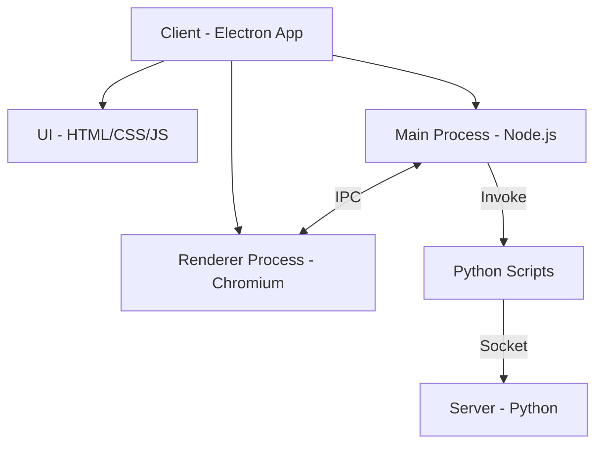

Hình 1: Kiến trúc tổng thể của Transfer Trail

### 3.2 Lý do chọn Electron và Python

1. **Electron**: 
   - Cho phép phát triển ứng dụng desktop đa nền tảng với công nghệ web.
   - Tích hợp sẵn Node.js, mang lại khả năng tương tác mạnh mẽ với hệ thống.
   - Cộng đồng lớn và nhiều tài nguyên hỗ trợ.

2. **Python**: 
   - Hiệu suất cao trong xử lý I/O và mạng.
   - Thư viện chuẩn phong phú cho lập trình mạng và xử lý file.
   - Dễ dàng triển khai logic server phức tạp.

Sự kết hợp này cho phép tận dụng ưu điểm của cả hai công nghệ: giao diện người dùng linh hoạt của Electron và khả năng xử lý mạng mạnh mẽ của Python.

## 4. Giao diện Người dùng

### 4.1 Tổng quan Giao diện

Giao diện người dùng của Transfer Trail được thiết kế với mục tiêu đơn giản, trực quan và dễ sử dụng. Nó bao gồm các thành phần chính sau:

1. Thanh bên (Sidebar)
2. Khu vực tải lên (Upload area)
3. Danh sách file (File list)
4. Thanh tiến trình (Progress bar)
5. Thông báo (Notifications)

### 4.2 Các thành phần UI chính

| Thành phần | Chức năng |
|------------|-----------|
| Thanh bên | Hiển thị các danh mục file và cho phép lọc danh sách file |
| Khu vực tải lên | Cho phép người dùng kéo thả hoặc chọn file để tải lên |
| Danh sách file | Hiển thị các file có sẵn trên server với thông tin chi tiết |
| Thanh tiến trình | Hiển thị tiến độ tải lên/tải xuống file |
| Thông báo | Cung cấp phản hồi về các hoạt động và trạng thái của ứng dụng |

### 4.3 Hình ảnh Giao diện

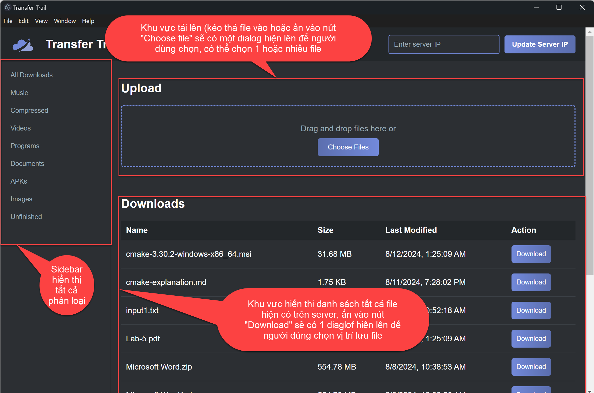
*Hình 2: Giao diện chính của Transfer Trail*

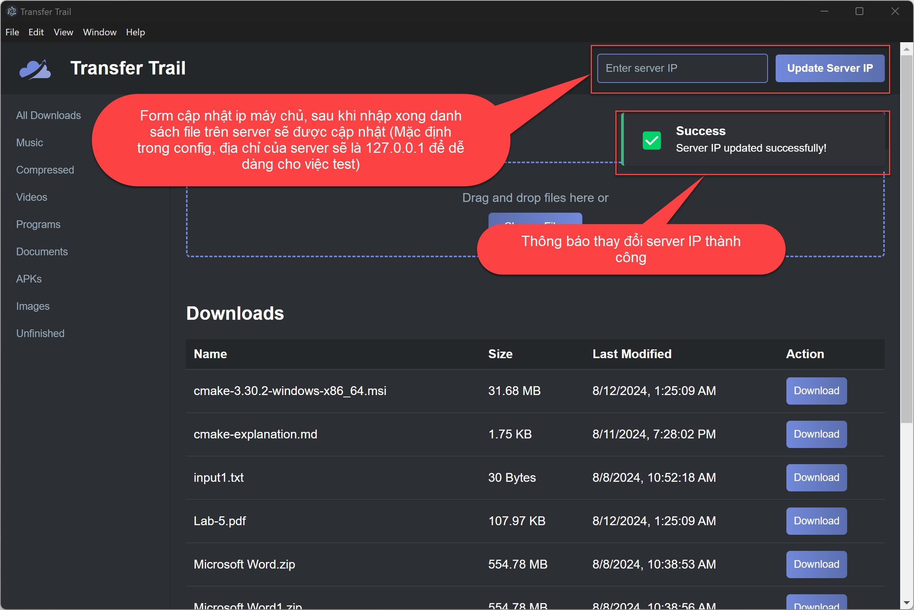
*Hình 3: Form cập nhật IP Server*

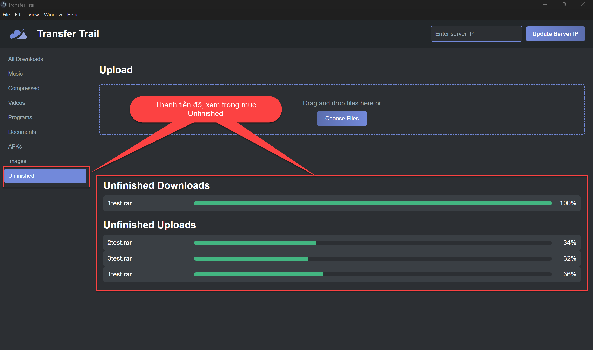
*Hình 4: Hiển thị tiến độ tải xuống/tải lên*

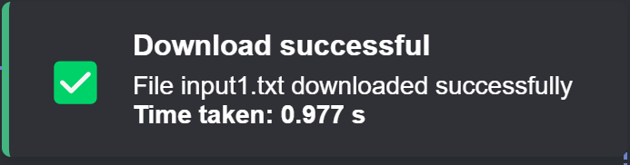
*Hình 5: Thông báo thành công*


*Hình 6: Thông báo lỗi*

## 5. Thành phần phía Client

### 5.1 Giới thiệu về Electron

Electron là một framework mã nguồn mở cho phép phát triển ứng dụng desktop đa nền tảng sử dụng các công nghệ web. Nó kết hợp Chromium và Node.js vào một runtime duy nhất, cho phép xây dựng ứng dụng bằng HTML, CSS, và JavaScript.

Electron hoạt động dựa trên hai loại tiến trình chính:

1. **Main Process**: Quản lý vòng đời ứng dụng, tạo và quản lý cửa sổ, tương tác với hệ thống.
2. **Renderer Process**: Hiển thị giao diện người dùng và xử lý tương tác người dùng.

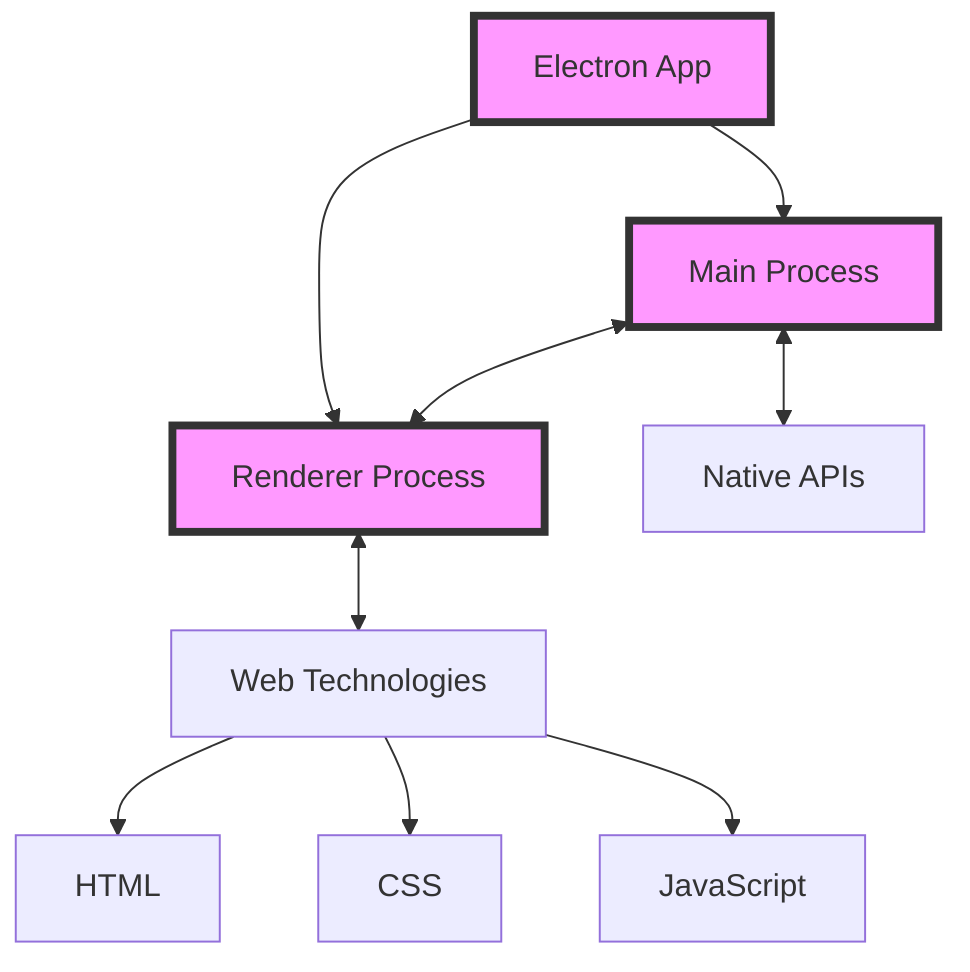

Hình 7: Cấu trúc cơ bản của ứng dụng Electron

### 5.2 Cấu trúc Thành phần Client

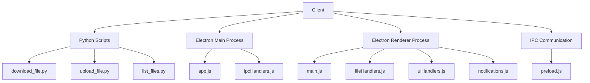

Hình 8: Cấu trúc thành phần phía Client

#### 5.2.1 Python Scripts

- `download_file.py`: Xử lý tải file từ server.
- `upload_file.py`: Quản lý quá trình tải file lên server.
- `list_files.py`: Lấy danh sách file từ server.

#### 5.2.2 Electron Main Process

- `app.js`: Khởi tạo ứng dụng và quản lý vòng đời.
- `ipcHandlers.js`: Xử lý các sự kiện IPC giữa Main Process và Renderer Process.

#### 5.2.3 Electron Renderer Process

- `main.js`: Khởi tạo giao diện người dùng và xử lý tương tác.
- `fileHandlers.js`: Quản lý các hoạt động liên quan đến file.
- `uiHandlers.js`: Cập nhật giao diện người dùng.
- `notifications.js`: Hiển thị thông báo cho người dùng.

#### 5.2.4 IPC Communication

- `preload.js`: Cầu nối giữa Main Process và Renderer Process, cung cấp các API an toàn cho Renderer Process.

### 5.3 Luồng Dữ liệu

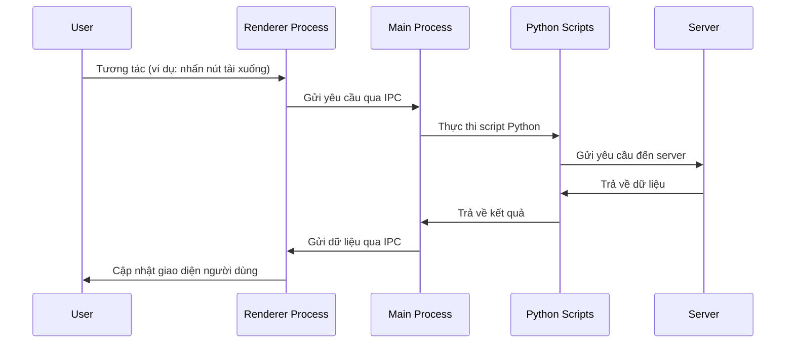

Hình 9: Luồng dữ liệu trong ứng dụng Transfer Trail

## 6. Thành phần phía Server

### 6.1 Cấu trúc Server

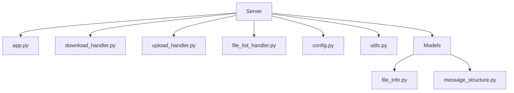

Hình 10: Cấu trúc thành phần phía Server

### 6.2 Chức năng các Module

- `app.py`: Thiết lập server và xử lý kết nối client.
- `download_handler.py`: Xử lý yêu cầu tải xuống file.
- `upload_handler.py`: Xử lý yêu cầu tải lên file.
- `file_list_handler.py`: Quản lý và cung cấp danh sách file.
- `config.py`: Chứa các cấu hình server.
- `utils.py`: Chứa các hàm tiện ích.
- `models/file_info.py`: Định nghĩa cấu trúc thông tin file.
- `models/message_structure.py`: Định nghĩa cấu trúc message giao tiếp.

### 6.3 Xử lý Đồng thời

Server sử dụng mô hình đa luồng để xử lý đồng thời nhiều yêu cầu từ client:

1. Mỗi kết nối client được xử lý trong một luồng riêng biệt.
2. Sử dụng threading pool để quản lý hiệu quả các luồng.
3. Áp dụng lock để đồng bộ hóa truy cập vào tài nguyên chia sẻ.

## 7. Giao thức giao tiếp (Protocol Communication)

### 7.1 Cấu trúc Message

Mỗi message giữa client và server có cấu trúc như sau:

1. 1 byte cho mã hoạt động (op_code)
2. 4 bytes cho độ dài payload
3. Payload (độ dài thay đổi)

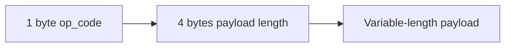

Hình 11: Cấu trúc message

### 7.2 Các loại Yêu cầu và Phản hồi

| Opcode | Ý nghĩa |
| --- | --- |
| 1 | FILE_LIST_REQUEST |
| 2 | FILE_LIST_RESPONSE |
| 3 | DOWNLOAD_REQUEST |
| 4 | DOWNLOAD_RESPONSE |
| 5 | DOWNLOAD_PART_PORT |
| 6 | DOWNLOAD_PART_NUMBER |
| 7 | UPLOAD_REQUEST |
| 8 | UPLOAD_RESPONSE |
| 9 | UPLOAD_PART_PORT |
| 10 | UPLOAD_PART_NUMBER |
| 11 | FILE_MD5 |
| 12 | ERROR |

### 7.3 Quy trình giao tiếp

#### File Download Process

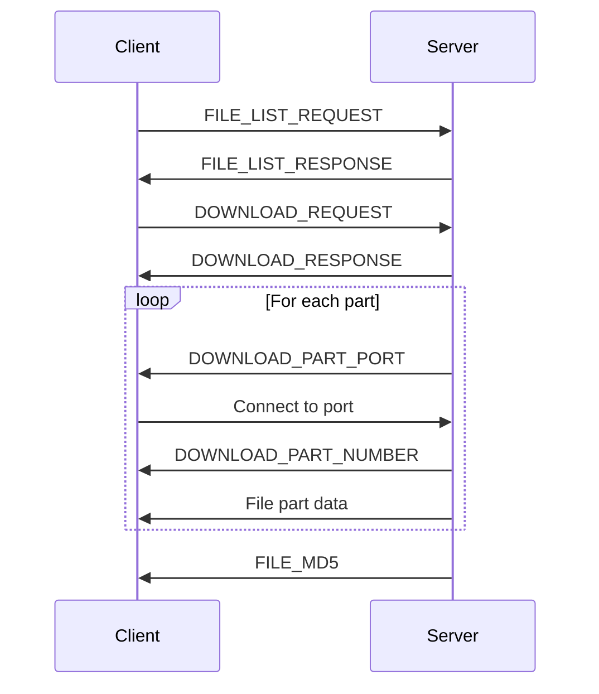

Hình 12: Quy trình giao tiếp khi download file

#### File Upload Process

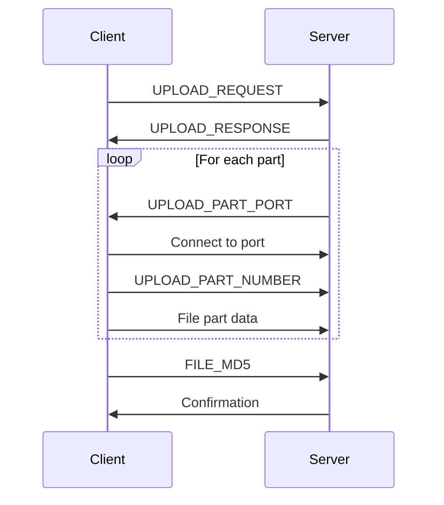

Hình 13: Quy trình giao tiếp khi upload file

## 8. Xử lý File Lớn

### 8.1 Phân chia File

- File được chia thành nhiều phần nhỏ, mỗi phần có kích thước cố định.
- Số lượng phần được xác định dựa trên kích thước file và cấu hình server.

### 8.2 Truyền Đa luồng

- Mỗi phần file được truyền qua một luồng riêng biệt.
- Sử dụng nhiều kết nối socket đồng thời để tối ưu hóa tốc độ truyền.

### 8.3 Quản lý Bộ nhớ

- Sử dụng kỹ thuật streaming để đọc và ghi file theo từng chunk nhỏ.
- Áp dụng cơ chế buffer để cân bằng giữa hiệu suất và sử dụng bộ nhớ.
- Sau khi nhận một chunk thành công, chương trình sẽ lưu vào ROM để tránh tràn bộ nhớ đệm buffer.

### 8.4 Khôi phục Truyền

- Lưu trữ trạng thái truyền của từng phần file.
- Cho phép tiếp tục truyền từ điểm gián đoạn nếu có lỗi xảy ra.

## 9. Bảo mật

### 9.1 Biện pháp Bảo mật Hiện tại

1. Sử dụng MD5 hash để xác minh tính toàn vẹn của file sau khi truyền.
2. Giới hạn quyền truy cập vào thư mục chứa file trên server.

### 9.2 Kế hoạch Bảo mật Tương lai

1. Triển khai mã hóa end-to-end cho quá trình truyền file.
2. Tích hợp hệ thống xác thực người dùng.
3. Áp dụng HTTPS cho giao tiếp giữa client và server.
4. Triển khai cơ chế kiểm soát truy cập dựa trên vai trò.

## 10. Hướng dẫn chạy phần mềm

### 10.1 Yêu cầu Hệ thống

- Node.js v20.15.1 trở lên ([Link](https://nodejs.org/en)).
- Python 3.12.3 trở lên ([Link](https://www.python.org/downloads/)).
- Electron (sẽ được cài đặt tự động qua npm)

### 10.2 Cài đặt

1. Clone repository hoặc tải source code trên moodle:
   ```
   git clone https://github.com/petiheo/TransferTrail
   cd transferTrail
   ```

2. Cài đặt dependencies:
   ```
   npm install
   ```

3. Cấu hình:
   - Chỉnh sửa file `config.json` để cấu hình địa chỉ IP và cổng của server.

4. Chạy ứng dụng:
   - Server: `python server/app.py`
   - Client: `npm start`

## 11. Kết luận và Hướng phát triển

Transfer Trail đã đạt được mục tiêu ban đầu là cung cấp một giải pháp truyền file hiệu quả và đáng tin cậy. Dự án đã thành công trong việc:

1. Tạo ra một ứng dụng đa nền tảng với giao diện người dùng thân thiện.
2. Triển khai cơ chế truyền file đa luồng để tối ưu hiệu suất.
3. Xử lý hiệu quả các file có kích thước lớn.

Hướng phát triển trong tương lai:

1. Tích hợp mã hóa end-to-end để tăng cường bảo mật.
2. Phát triển tính năng đồng bộ hóa thư mục.
3. Tích hợp với các dịch vụ lưu trữ đám mây.
4. Cải thiện UI/UX dựa trên phản hồi của người dùng.
5. Tối ưu hóa thuật toán nén để giảm dung lượng truyền tải.

## 12. Phụ lục

### 12.1 Thuật ngữ

- **Electron**: Framework để xây dựng ứng dụng desktop đa nền tảng bằng công nghệ web.
- **IPC (Inter-Process Communication)**: Cơ chế giao tiếp giữa các tiến trình trong Electron.
- **Socket**: Điểm cuối của liên kết giao tiếp hai chiều giữa hai chương trình chạy trên mạng.
- **MD5 Hash**: Thuật toán mã hóa được sử dụng để tạo "dấu vân tay" 128-bit cho một file.

### 12.2 Cấu trúc Thư mục Dự án

```
transfer-trail/
├── client/
│   ├── public/
│   ├── src/
│   │   ├── electron/
│   │   └── renderer/
│   ├── python/
│   └── package.json
├── server/
│   ├── src/
├── images/
└── README.md
```

## 13. Tài liệu tham khảo

1. Electron Documentation. https://www.electronjs.org/docs/latest/
2. Python Socket Programming. https://docs.python.org/3/library/socket.html
3. Python operating system interfaces. https://docs.python.org/3/library/os.html
4. Node.js Documentation. https://nodejs.org/en/docs/
5. MDN Web Docs. https://developer.mozilla.org/en-US/
6. Python Threading Documentation. https://docs.python.org/3/library/threading.html
7. Các vấn đề, thắc mắc chung. https://stackoverflow.com/, https://www.geeksforgeeks.org/, https://realpython.com/
8. Các tutorial liên quan (electron, python): https://www.youtube.com/
